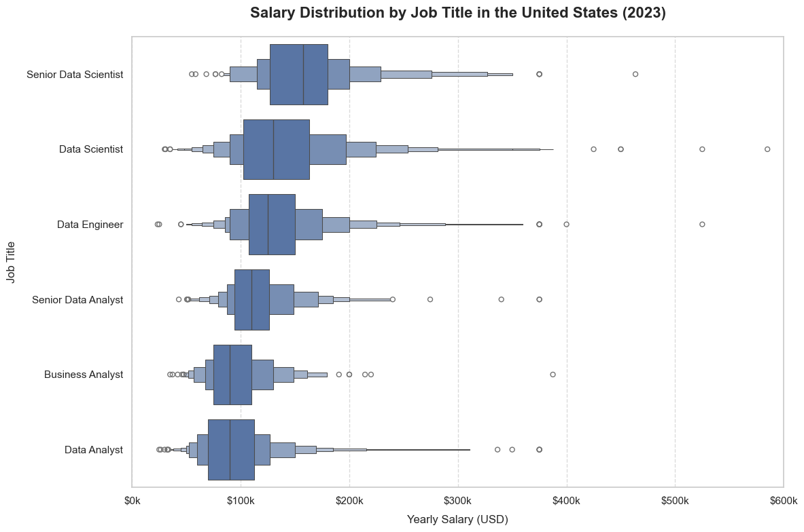
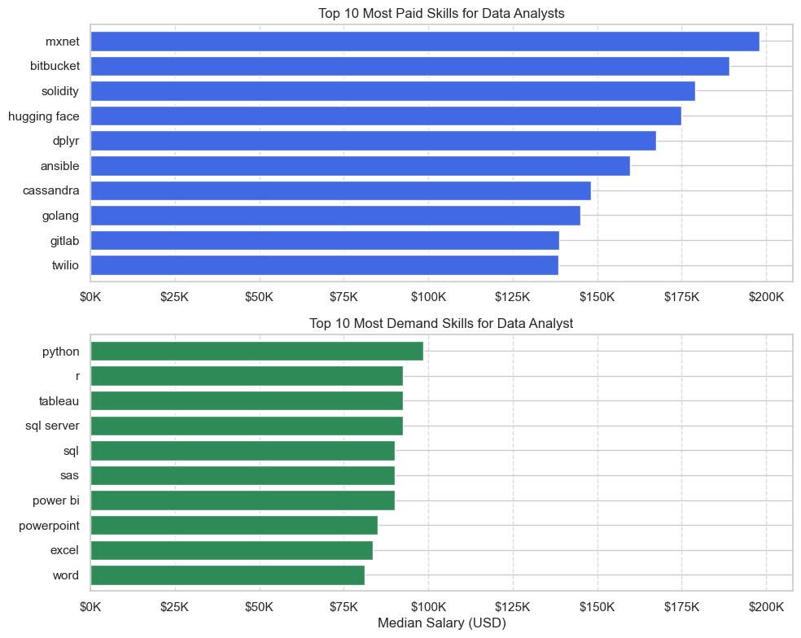
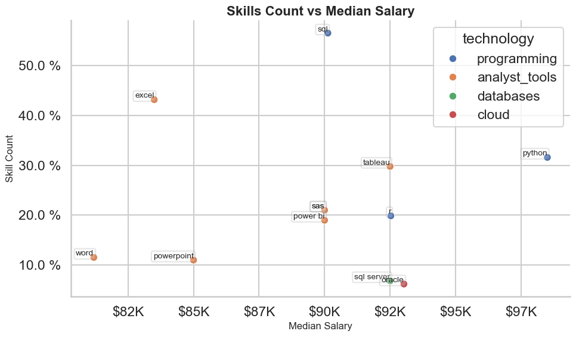

# Job Market Analysis (US) - 2023

This project provides an analysis of the job market for data analysts in the United States, with a focus on job locations, key skills, benefits, salaries, and trending skills. The analysis aims to offer valuable insights for job seekers, employers, and professionals in the data analyst field.
<br><br>

## Project Overview

This project explores the data analyst job market in the US, analyzing various aspects of job postings such as location, key skills, job benefits, and salary trends. Through visualizations, this project highlights the cities with the highest demand for data analysts, the most in-demand skills, and the compensation offered for various data-related roles.
<br><br>

## Tools and Libraries Used
- **Pandas**: For data manipulation and cleaning.
- **Seaborn**: For creating visualizations such as bar charts, pie charts, and line plots.
- **Matplotlib**: For generating additional plots like boxenplots.
- **Python**: The primary programming language used for data analysis and visualizations.
<br><br>

## Key Sections

### a. Exploratory Data Analysis of Data Analyst Jobs in the US
  
### b. Analysis of the Top 5 Skills for the Top 3 Data Roles in the US

### c. Trending Skills for Data Analysts in the US (2023)

### d. Salary Analysis and Skill Demand for Data Analysts in the US (2023)

### e. Top 10 Highest Paying and Most Common Skills for Data Analysts
<br><br>


# a. Exploratory Data Analysis of Data Analyst Jobs in the US

## 1. Where Are the Top Locations for Data Analyst Jobs in the US?

### Description:

This bar chart displays the top 10 job locations in the United States for data analyst positions. The data was filtered to count the occurrences of each job location, helping identify the states or cities with the highest demand for data analysts. The `Seaborn` library was used to create the visualization.

view my notebook with detailed steps here : [1_EDA_intro.ipynb](notebooks/1_EDA_intro.ipynb)

### Visualize Code:

```python
df_plot = df_DA_US.job_location.value_counts().head(10).to_frame()

plt.figure(figsize=(10 , 8))
sns.set_style(style="whitegrid")

sns.barplot(
    data=df_plot,
    x="count",
    y="job_location",
    palette="crest"
)
sns.despine()
plt.title("Where Are the Top Locations for Data Analyst Jobs in the US?")
plt.xlabel("Number of Jobs")
plt.ylabel("")
plt.show()
```

### The Result:


<br><br>

## 2. What Are the Key Benefits and Requirements for Data Analyst Jobs?

### Description:

These pie charts provide insights into some of the key benefits and requirements for data analyst jobs:

- The first chart shows the proportion of jobs that offer work-from-home opportunities versus those that don’t.
- The second chart highlights the degree requirements for data analyst jobs, revealing how many positions explicitly mention the necessity of a degree.
- The third chart outlines the availability of health insurance for data analyst roles, indicating how many jobs offer this benefit.

The data was processed using the `value_counts` method to calculate the percentages, and `Matplotlib` was used to visualize the results with pie charts.

view my notebook with detailed steps here : [1_EDA_intro.ipynb](notebooks/1_EDA_intro.ipynb)

### Visualize Code:

```python
fig, ax = plt.subplots(1, 3, figsize=(15, 5))

dict_columns = {
    "job_work_from_home": "Work From Home Status",
    "job_no_degree_mention": "Job Degree Requirement",
    "job_health_insurance": "Health Insurance Offered",
}

for i, (col, title) in enumerate(dict_columns.items()):
    counts = df_DA_US[col].value_counts()
    ax[i].pie(
        counts,
        labels=counts.index,
        autopct='%1.1f%%',
        startangle=90,
        colors=sns.color_palette("crest", len(counts))
    )
    ax[i].set_title(title)

plt.tight_layout()
plt.show()

```

### The Result:


<br><br>

## 3. Which Companies Are Hiring the Most Data Analysts in the US?

### Description:

This bar chart highlights the top companies hiring the most data analysts in the US. The data was processed by counting the occurrences of each company name in the dataset. This visualization helps us identify the major players in the job market for data analysts. The `Seaborn` library was used to create the bar chart

view my notebook with detailed steps here : [1_EDA_intro.ipynb](notebooks/1_EDA_intro.ipynb)

### Visualize Code:

```python
df_plot = df_DA_US.company_name.value_counts().head(10).to_frame()

plt.figure(figsize=(10 , 8))
sns.set_style(style="whitegrid")

sns.barplot(
    data=df_plot,
    x="count",
    y="company_name",
    palette="crest"
)
sns.despine()
plt.title("Which Companies Are Hiring the Most Data Analysts in the US?")
plt.xlabel("Number of Jobs")
plt.ylabel("")
plt.show()
```

### The Result:


<br><br>

## Insights

### 1. Where Are the Top Locations for Data Analyst Jobs in the US?

- The chart shows that the majority of data analyst job opportunities are concentrated in a few key locations, with cities like San Francisco, New York, and Chicago standing out. This indicates a higher demand for data analysts in tech hubs and major metropolitan areas. Professionals looking for data analyst roles may consider relocating to these cities for more job opportunities.

### 2. What Percentage of Data Analyst Jobs Allow Work from Home?

- A significant portion of data analyst positions offer work-from-home options, reflecting the growing trend of remote work in the tech industry. This trend is likely driven by the increasing acceptance of flexible work environments and the nature of data analysis work, which can often be done remotely. Job seekers can prioritize companies offering remote opportunities for better work-life balance.

### 3. How Many Data Analyst Jobs Offer Health Insurance?

- The chart indicates that a notable percentage of data analyst jobs offer health insurance benefits, which is an important factor for potential employees. Companies offering health insurance may attract a larger pool of candidates who value comprehensive employee benefits. This trend highlights the importance of health coverage as part of the overall compensation package in the tech sector.
  <br><br>
  <br><br>

# b. Analysis of the Top 5 Skills for the Top 3 Data Roles in the US

## What Are the Top 5 Skills for the Top 3 Data Analyst Roles in the US?

### Description:

This set of bar charts shows the top 5 skills required for the top 3 data roles in the US. It displays the percentage of job postings mentioning each skill. The charts are created using `Seaborn` to highlight the most common skills for these roles, helping job seekers understand what skills employers are looking for.

view my notebook with detailed steps here : [2_skills_Count.ipynb](notebooks/2_skills_Count.ipynb)

### Visualization Code:

```python
sns.set_style(style="whitegrid")

fig, ax = plt.subplots(len(job_titles), 1, figsize=(12, 8), sharex=True)
fig.suptitle("Likelihood For Top 5 Skills in US Job Posting", fontsize=16, y=1.02)

for i, job_title in enumerate(job_titles):
    df_plot = df_likelilooh[df_likelilooh.job_title_short == job_title].head(5)

    # Plot on the corresponding axis
    sns.barplot(
        data=df_plot,
        x="percenteage",
        y="job_skills",
        hue="skill_count",
        legend=False,
        palette="crest",
        ax=ax[i]  # Specify the axis for each plot
    )

    for n, v in enumerate(df_plot["percenteage"]):
        ax[i].text(v + 1, n, f"{v:.0f}%", va="center")
    # Remove unnecessary spines and set title and labels
    sns.despine(ax=ax[i])
    ax[i].set_title(f"Top 5 Skills For {job_title}")
    ax[i].set_xlabel("Number Of Jobs")
    ax[i].set_ylabel("")
    ax[i].xaxis.set_major_formatter(lambda x, _: f'{x} %')

plt.ylabel(" ")
plt.tight_layout()
plt.show()

```

### The Result:


## Insights

1. **Top Data Roles in the US**: The chart identifies the top 3 data-related roles in the US, showing which positions are in the highest demand.

2. **Most Common Skills for Data Roles**: The bar charts reveal the top 5 most important skills for each of these roles. This information helps job seekers focus on the key skills that employers prioritize.

3. **Skill Distribution Across Roles**: By visualizing the percentage of job postings mentioning each skill, we can see the skills that are most sought after in the job market for data professionals.
   <br><br>
   <br><br>

# c. Trending Skills for Data Analysts in the US: Analyzing Job Postings for 2023

## What are the top trending skills for Data Analysts in the US job market in 2023?

### Description :

This notebook analyzes the top skills required for Data Analyst positions in the US based on 2023 job postings. We filter the data to focus on Data Analyst roles and then track the most common skills mentioned across job listings. Using `Seaborn`, we visualize the trend of these skills over the months of 2023, helping job seekers understand which skills are in demand for Data Analysts.

view my notebook with detailed steps here : [3_skills_Trend.ipynb](notebooks/3_skills_Trend.ipynb)

### Visualize Code:

```python
sns.set_style(style="whitegrid")
sns.lineplot(data=df_plot, dashes=False, palette="tab10")

plt.title("Trending Top Skills for Data Analysts in US")
plt.ylabel("Likelihood in Job Posting")
plt.xlabel("2023")
plt.legend().remove()

plt.ylim(10, 55)

from matplotlib.ticker import PercentFormatter
ax = plt.gca()
ax.yaxis.set_major_formatter(PercentFormatter(decimals=0))

for i in range(len(df_plot.columns)):
    if df_plot.columns[i] == "python":
        plt.text(11, df_plot.iloc[-1, i] - 2, df_plot.columns[i])
    else:
        plt.text(11, df_plot.iloc[-1, i] + 1, df_plot.columns[i])

plt.show()
```

### The Result:


### Insights

- **Python is the Leading Skill**: Python consistently emerges as one of the top skills in Data Analyst job postings throughout 2023, showing its importance in the industry.
- **Trending Skills over Time**: Certain skills like SQL, Excel, and data visualization tools show fluctuations, indicating varying demand during different months.
- **Increased Focus on Analytical Skills**: The trendline highlights that technical skills such as Python and SQL are steadily in demand, while other skills like Excel and machine learning have periodic surges.
- **Strategic Skill Development**: For Data Analysts looking to boost their careers, focusing on skills that show consistent demand (like Python and SQL) may offer the best job opportunities in 2023.
- **Job Market Insights**: The analysis helps professionals understand which skills are crucial to remain competitive in the Data Analyst field.

<br><br>
<br><br>

# d. Salary Analysis and Skill Demand for Data Analysts in the United States (2023)

## 1. What is the Salary Distribution by Job Title in the United States for 2023?

## Description:

This chart visualizes the salary distribution across the top 6 job titles in the United States for 2023. By using a **boxenplot**, we show the spread and range of yearly salaries for each job title. The plot helps to compare how salaries vary across roles, providing a clear view of the most common and extreme salary values within these positions.

view my notebook with detailed steps here : [4_Salary_Analysis.ipynb](notebooks/4_Salary_Analysis.ipynb)

## Visualization Code:

```python
sns.set_theme(style="whitegrid")

# Create the boxenplot
plt.figure(figsize=(12, 8))
sns.boxenplot(
    data=df_us_top6,
    x="salary_year_avg",
    y="job_title_short",
    order=job_order
)

# Add a descriptive title and axis labels
plt.title("Salary Distribution by Job Title in the United States (2023)", fontsize=16, weight="bold", pad=20)
plt.xlabel("Yearly Salary (USD)", fontsize=12, labelpad=10)
plt.ylabel("Job Title", fontsize=12, labelpad=10)

# Customize the x-axis scale and format
plt.xlim(0, 600000)
plt.gca().xaxis.set_major_formatter(lambda x, pos: f"${int(x / 1000)}k")

# Add grid lines for easier interpretation
plt.grid(axis="x", linestyle="--", alpha=0.7)

# Adjust layout for better spacing
plt.tight_layout()

# Display the plot
plt.show()
```

### The Result:



## 2. What are the Top 10 Highest Paying and Most Common Skills for Data Analysts in the United States?

## Description:

This visualization provides two key insights for Data Analysts in the United States:

1. **Top 10 Most Paid Skills**: A horizontal bar chart showing the median salary for each skill. This highlights the skills that offer the highest salaries for Data Analysts.
2. **Top 10 Most Common Skills**: Another horizontal bar chart that shows the frequency of each skill in job postings, highlighting the most in-demand skills.

By comparing both charts, job seekers and professionals can better understand which skills are not only in demand but also offer higher pay.

view my notebook with detailed steps here : [4_Salary_Analysis.ipynb](notebooks/4_Salary_Analysis.ipynb)

## Visualization Code:

```python
sns.set(style="whitegrid")

# Create the figure and axes
fig, ax = plt.subplots(2, 1, figsize=(10, 8))

# Plot the top 10 highest-paying skills for Data Analysts
df_DA_top_pay[::-1].plot(
    kind="barh",
    y="median",
    ax=ax[0],
    color="royalblue",
    legend=False,
    title="Top 10 Most Paid Skills for Data Analysts",
    xlabel="",
    ylabel="",
    width=0.8
)

# Format the x-axis for salary
ax[0].xaxis.set_major_formatter(lambda x , _ : f'${int(x/1000)}K')

# Plot the top 10 most common skills for Data Analysts
df_DA_top_skills[::-1].plot(
    kind="barh",
    y="median",
    ax=ax[1],
    color="seagreen",
    legend=False,
    xlabel="Median Salary (USD)",
    ylabel="",
    width=0.8,
    title="Top 10 Most Demand Skills for Data Analyst",
)

# Format the x-axis for salary
ax[1].xaxis.set_major_formatter(lambda x , _ : f'${int(x/1000)}K')

# Set consistent x-limits for both subplots
ax[1].set_xlim(ax[0].get_xlim())

# Add gridlines for better readability
ax[0].grid(True, axis="x", linestyle="--", alpha=0.7)
ax[1].grid(True, axis="x", linestyle="--", alpha=0.7)

# Adjust layout and show the plot
fig.tight_layout()
plt.show()
```

### The Result:



### Insights from the Box Plot for Salary Distribution by Job Title

1. **Salary Differences in High-Demand Roles**  
   The box plot shows that roles like **Data Scientist** and **Software Engineer** have big salary differences, meaning pay can vary a lot depending on factors like experience, location, and company. Some people in these roles earn very high salaries, while others earn lower ones.

2. **Median Salary Trends**  
   **Data Scientist** has the highest median salary, followed by **Software Engineer** and **Product Manager**. This shows these jobs are in high demand and pay well. On the other hand, roles like **Marketing Analyst** have lower median salaries, which may reflect less demand or fewer specialized skills.

### Insights from the Chart: Top 10 Highest Paying and Most Common Skills for Data Analysts in the United States

1. **Common vs. High-Paying Skills**  
   Skills like "SQL" and "Python" are frequently listed in job postings and also have high pay. This shows that these basic skills are essential for getting hired and earning good salaries in Data Analyst roles.

2. **Emerging Skills with High Pay**  
    Skills like "Machine Learning" and "Cloud Computing" are less common but offer high median salaries. This suggests that Data Analysts with expertise in these areas can earn significantly more, making these skills valuable for career growth.
   <br><br>
   <br><br>

# e. Exploring the Relationship Between Skill Count and Median Salary for Data Analysts in the United States

## How Does Skill Count Relate to Median Salary for Data Analysts?

### Description:

This scatter plot visualizes the relationship between the frequency of specific skills mentioned in Data Analyst job postings and their median salaries in the United States. The chart plots each skill's percentage of job postings on the y-axis and its median salary on the x-axis. Different technologies associated with each skill are represented by varying colors, providing a clear understanding of how skills and technology types relate to salary. This analysis helps identify which skills are most in demand and how they correlate with higher earning potential for Data Analysts.

view my notebook with detailed steps here : [5_Optimal_Skills.ipynb](notebooks/5_Optimal_Skills.ipynb)

### Visualization Code:

```python
# Set Seaborn style
sns.set(style="whitegrid", context="talk")

# Create the scatter plot
plt.figure(figsize=(10, 6))
scatter = sns.scatterplot(
    data=df_plot,
    y="skill_percent",  # Y-axis: Percentage of job listings mentioning each skill
    x="median_salary",   # X-axis: Median salary for each skill
    hue="technology"     # Hue: Different technologies associated with each skill
)

# Annotate each point with its corresponding skill name
for i, text in enumerate(df_plot.index):
    plt.text(
        y=df_plot["skill_percent"].iloc[i],
        x=df_plot["median_salary"].iloc[i],
        s=df_plot["skills"].iloc[i],  # Skill name annotation
        fontsize=10,
        ha='right',
        va='bottom',
        bbox=dict(boxstyle="round,pad=0.2", edgecolor="gray", facecolor="white", alpha=0.2)
    )

# Add titles and labels
plt.title("Skills Count vs Median Salary", fontsize=16, fontweight='bold')
plt.ylabel("Skill Count", fontsize=12)
plt.xlabel("Median Salary", fontsize=12)

# Format axes for better readability
ax = plt.gca()
ax.xaxis.set_major_formatter(plt.FuncFormatter(lambda y, __ : f"${int(y/1000)}K" ))
ax.yaxis.set_major_formatter(lambda x , _ : f'{x} %')

# Remove top and right spines for aesthetics
sns.despine()

# Adjust layout and show plot
plt.tight_layout()
plt.show()
```

### The Result:



### Insights from the Chart: Skills Count vs. Median Salary

1. **High Skill Count vs. High Median Salary**  
   The chart reveals that skills with a higher percentage of mentions in job listings, such as "SQL" and "Python," tend to be associated with higher median salaries. This indicates that foundational skills that are in high demand also command better compensation, showcasing their importance for Data Analysts in the United States.

2. **Specialized Skills with High Earning Potential**  
   Some specialized skills, like "Machine Learning" and "Cloud Computing," may appear less frequently in job listings but are linked to higher median salaries. This suggests that Data Analysts with niche expertise in emerging fields can secure significantly higher-paying positions, highlighting the value of acquiring advanced technical skills.
