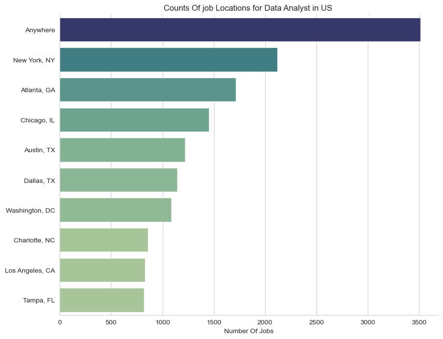
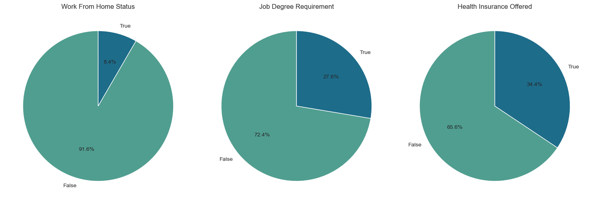
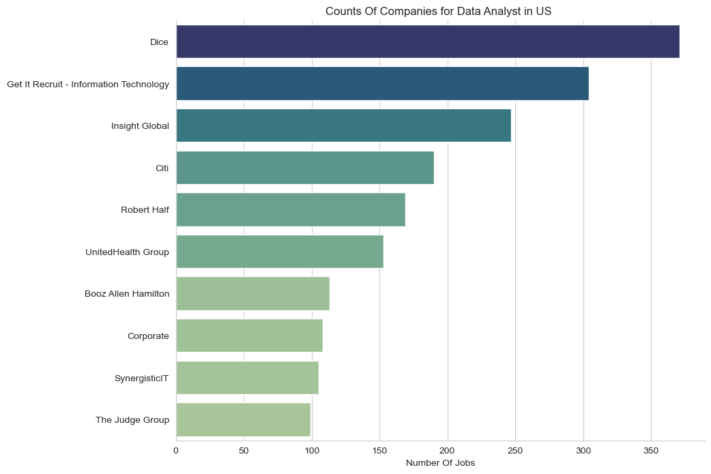
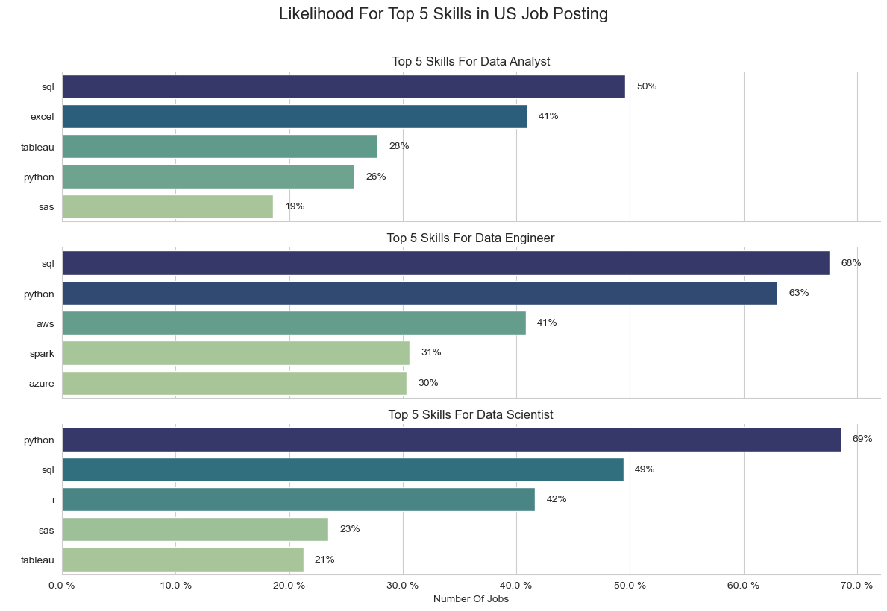
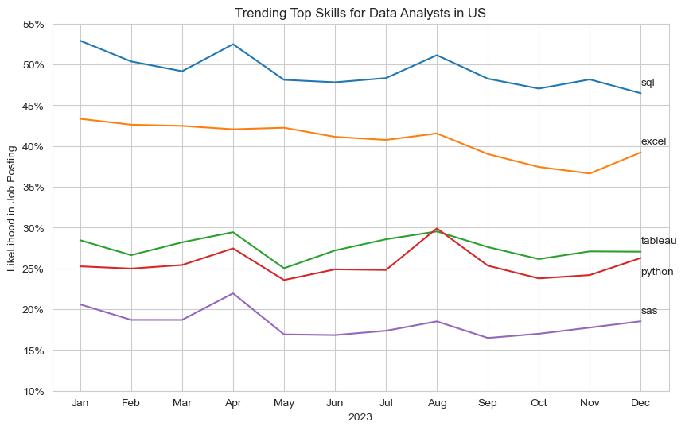

# Exploratory Data Analysis of Data Analyst Jobs in the US

## 1. Where Are the Top Locations for Data Analyst Jobs in the US?

### Description:
This bar chart displays the top 10 job locations in the United States for data analyst positions. The data was filtered to count the occurrences of each job location, helping identify the states or cities with the highest demand for data analysts. The `Seaborn` library was used to create the visualization.

view my notebook with detailed steps here : [1_EDA_intro.ipynb](notebooks/1_EDA_intro.ipynb)

### Visualize Data:
```python
df_plot = df_DA_US.job_location.value_counts().head(10).to_frame()

plt.figure(figsize=(10 , 8))
sns.set_style(style="whitegrid")

sns.barplot(
    data=df_plot, 
    x="count", 
    y="job_location",
    palette="crest"
)
sns.despine()
plt.title("Where Are the Top Locations for Data Analyst Jobs in the US?")
plt.xlabel("Number of Jobs")
plt.ylabel("")
plt.show()
```
### The Result:


<br><br> 


## 2. What Are the Key Benefits and Requirements for Data Analyst Jobs?

### Description:
These pie charts provide insights into some of the key benefits and requirements for data analyst jobs:
- The first chart shows the proportion of jobs that offer work-from-home opportunities versus those that don’t.
- The second chart highlights the degree requirements for data analyst jobs, revealing how many positions explicitly mention the necessity of a degree.
- The third chart outlines the availability of health insurance for data analyst roles, indicating how many jobs offer this benefit.

The data was processed using the `value_counts` method to calculate the percentages, and `Matplotlib` was used to visualize the results with pie charts.

view my notebook with detailed steps here : [1_EDA_intro.ipynb](notebooks/1_EDA_intro.ipynb)

### Visualize Data:
```python
fig, ax = plt.subplots(1, 3, figsize=(15, 5))

dict_columns = {
    "job_work_from_home": "Work From Home Status",
    "job_no_degree_mention": "Job Degree Requirement",
    "job_health_insurance": "Health Insurance Offered",
}

for i, (col, title) in enumerate(dict_columns.items()):
    counts = df_DA_US[col].value_counts()
    ax[i].pie(
        counts, 
        labels=counts.index, 
        autopct='%1.1f%%', 
        startangle=90, 
        colors=sns.color_palette("crest", len(counts))
    )
    ax[i].set_title(title)

plt.tight_layout()
plt.show()

```
### The Result:

<br><br> 

## 3. Which Companies Are Hiring the Most Data Analysts in the US?

### Description:
This bar chart highlights the top companies hiring the most data analysts in the US. The data was processed by counting the occurrences of each company name in the dataset. This visualization helps us identify the major players in the job market for data analysts. The `Seaborn` library was used to create the bar chart

view my notebook with detailed steps here : [1_EDA_intro.ipynb](notebooks/1_EDA_intro.ipynb)

### Visualize Data:
```python
df_plot = df_DA_US.company_name.value_counts().head(10).to_frame()

plt.figure(figsize=(10 , 8))
sns.set_style(style="whitegrid")

sns.barplot(
    data=df_plot, 
    x="count", 
    y="company_name",
    palette="crest"
)
sns.despine()
plt.title("Which Companies Are Hiring the Most Data Analysts in the US?")
plt.xlabel("Number of Jobs")
plt.ylabel("")
plt.show()
```
### The Result:

<br><br> 

## Insights

### 1. Where Are the Top Locations for Data Analyst Jobs in the US?
- The chart shows that the majority of data analyst job opportunities are concentrated in a few key locations, with cities like San Francisco, New York, and Chicago standing out. This indicates a higher demand for data analysts in tech hubs and major metropolitan areas. Professionals looking for data analyst roles may consider relocating to these cities for more job opportunities.

### 2. What Percentage of Data Analyst Jobs Allow Work from Home?
-  A significant portion of data analyst positions offer work-from-home options, reflecting the growing trend of remote work in the tech industry. This trend is likely driven by the increasing acceptance of flexible work environments and the nature of data analysis work, which can often be done remotely. Job seekers can prioritize companies offering remote opportunities for better work-life balance.

### 3. How Many Data Analyst Jobs Offer Health Insurance?
- The chart indicates that a notable percentage of data analyst jobs offer health insurance benefits, which is an important factor for potential employees. Companies offering health insurance may attract a larger pool of candidates who value comprehensive employee benefits. This trend highlights the importance of health coverage as part of the overall compensation package in the tech sector.
<br><br> 
<br><br> 

# 2. Analysis of the Top 5 Skills for the Top 3 Data Roles in the US

## What Are the Top 5 Skills for the Top 3 Data Analyst Roles in the US?

### Description:
This set of bar charts shows the top 5 skills required for the top 3 data roles in the US. It displays the percentage of job postings mentioning each skill. The charts are created using `Seaborn` to highlight the most common skills for these roles, helping job seekers understand what skills employers are looking for.

view my notebook with detailed steps here : [2_skills_Count.ipynb](notebooks/2_skills_Count.ipynb)

### Visualization Data:

```python
sns.set_style(style="whitegrid")

fig, ax = plt.subplots(len(job_titles), 1, figsize=(12, 8), sharex=True) 
fig.suptitle("Likelihood For Top 5 Skills in US Job Posting", fontsize=16, y=1.02)

for i, job_title in enumerate(job_titles): 
    df_plot = df_likelilooh[df_likelilooh.job_title_short == job_title].head(5)
    
    # Plot on the corresponding axis
    sns.barplot(
        data=df_plot, 
        x="percenteage", 
        y="job_skills",
        hue="skill_count",
        legend=False,
        palette="crest",
        ax=ax[i]  # Specify the axis for each plot
    )
    
    for n, v in enumerate(df_plot["percenteage"]):
        ax[i].text(v + 1, n, f"{v:.0f}%", va="center")
    # Remove unnecessary spines and set title and labels
    sns.despine(ax=ax[i])
    ax[i].set_title(f"Top 5 Skills For {job_title}")
    ax[i].set_xlabel("Number Of Jobs")
    ax[i].set_ylabel("")
    ax[i].xaxis.set_major_formatter(lambda x, _: f'{x} %')

plt.ylabel(" ")
plt.tight_layout()
plt.show()

```
### The Result:



## Insights

1. **Top Data Roles in the US**: The chart identifies the top 3 data-related roles in the US, showing which positions are in the highest demand.

2. **Most Common Skills for Data Roles**: The bar charts reveal the top 5 most important skills for each of these roles. This information helps job seekers focus on the key skills that employers prioritize.

3. **Skill Distribution Across Roles**: By visualizing the percentage of job postings mentioning each skill, we can see the skills that are most sought after in the job market for data professionals.
<br><br> 
<br><br> 

# 3. Trending Skills for Data Analysts in the US: Analyzing Job Postings for 2023

## What are the top trending skills for Data Analysts in the US job market in 2023?

### Description

This notebook analyzes the top skills required for Data Analyst positions in the US based on 2023 job postings. We filter the data to focus on Data Analyst roles and then track the most common skills mentioned across job listings. Using `Seaborn`, we visualize the trend of these skills over the months of 2023, helping job seekers understand which skills are in demand for Data Analysts.

view my notebook with detailed steps here : [3_skills_Trend.ipynb](notebooks/3_skills_Trend.ipynb)

### Plotting Code

```python
sns.set_style(style="whitegrid")
sns.lineplot(data=df_plot, dashes=False, palette="tab10")

plt.title("Trending Top Skills for Data Analysts in US")
plt.ylabel("Likelihood in Job Posting")
plt.xlabel("2023")
plt.legend().remove()

plt.ylim(10, 55)

from matplotlib.ticker import PercentFormatter
ax = plt.gca()
ax.yaxis.set_major_formatter(PercentFormatter(decimals=0))

for i in range(len(df_plot.columns)):
    if df_plot.columns[i] == "python":
        plt.text(11, df_plot.iloc[-1, i] - 2, df_plot.columns[i])
    else:
        plt.text(11, df_plot.iloc[-1, i] + 1, df_plot.columns[i])

plt.show()
```
### The Result:



### Insights

- **Python is the Leading Skill**: Python consistently emerges as one of the top skills in Data Analyst job postings throughout 2023, showing its importance in the industry.
- **Trending Skills over Time**: Certain skills like SQL, Excel, and data visualization tools show fluctuations, indicating varying demand during different months.
- **Increased Focus on Analytical Skills**: The trendline highlights that technical skills such as Python and SQL are steadily in demand, while other skills like Excel and machine learning have periodic surges.
- **Strategic Skill Development**: For Data Analysts looking to boost their careers, focusing on skills that show consistent demand (like Python and SQL) may offer the best job opportunities in 2023.
- **Job Market Insights**: The analysis helps professionals understand which skills are crucial to remain competitive in the Data Analyst field.